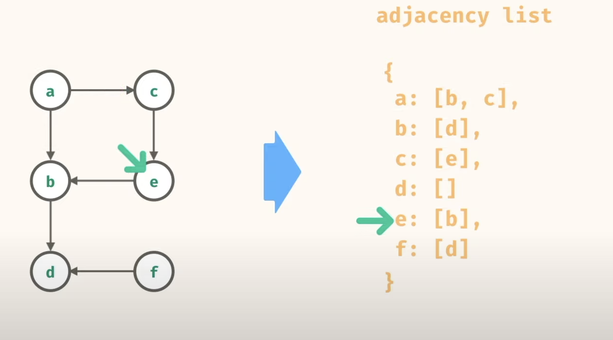

#Graph

Basics:

Set of Vertices and Edges
Each Vertex has [] of edges
Graph in Java can be described as adjacency list Map

Resources:

- [ ] [Graph Basics freeCodeCamp](https://www.youtube.com/watch?v=tWVWeAqZ0WU)

- [ ] 

Depth First Traversal:
Uses a Stack (LIFO)

If a node is reachable form start node or not
Find if a graph has cycle
Create a topological sorting from a graph like a job scheduling dependency
Find a path between 2 vertices

Breadth First Traversal:

Uses a Queue (FIFO)

